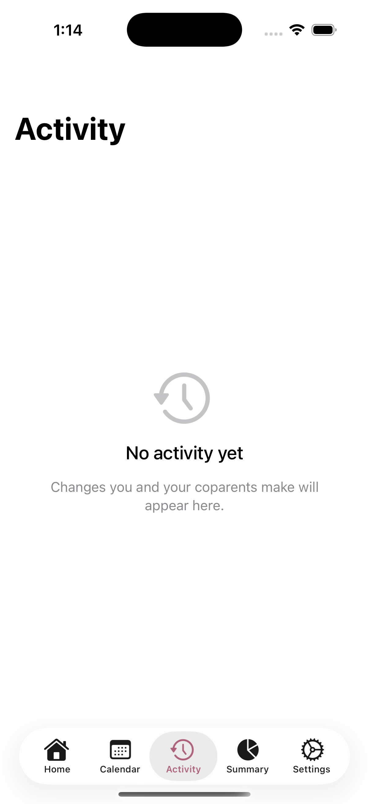
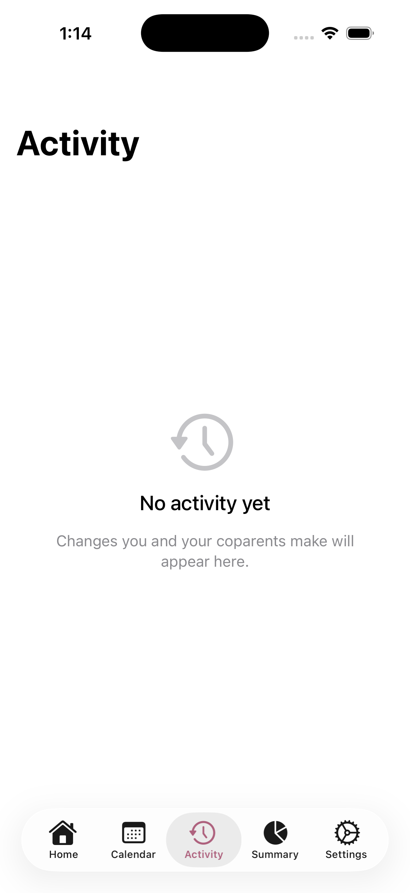

  

<h1 align="center">CoParenting</h1>

  <em>A coparenting app that doesn't suck.</em>

  
  
  

---

Most coparenting apps feel like they were designed by a divorce lawyer who charges by the pixel. They're clunky, adversarial, and seem to assume that the goal of shared parenting is generating evidence for court.

**CoParenting** is different. It's built on a radical premise: *two people who both love their kids can probably figure out a schedule without a $400/month SaaS platform and a 47-page terms of service.*

## What It Does

### AI-Powered Scheduling

Tell the AI what you need in plain English. "Set up a week where I have mornings and Sarah has afternoons." Done. No drag-and-drop grid from 2009. No accidentally giving Tuesday to three people.

The AI understands recurring schedules, one-off changes, and everything in between. It applies your changes, explains what it did, and writes a warm notification for your coparent. Because "SCHEDULE MODIFIED BY USER_A" is not how adults communicate.

### Care Balance Dashboard

The home screen shows you the big picture: how care time is distributed across the year between both parents. Not as a weapon. Not as a scorecard. Just a gentle, honest look at the numbers so you can plan together.

When things are balanced, it tells you. When they're not, it nudges — not nags — you to talk about it.

### Activity Journal

Every schedule change gets logged with context: what was requested, what changed, which dates were affected, and how it shifts the care balance. Tap into any entry for the full story, all the way down to the raw AI response if you're curious.

No more "wait, who changed Thursday?" conversations. It's all there.

### Weekly Calendar

A real calendar view (week and day modes) with color-coded blocks for each parent. See the whole picture at a glance. Edit blocks directly. The kind of calendar you'd actually want to look at.

### Care Time Summary

Monthly and yearly breakdowns of care hours per parent. Expandable day-by-day detail. The math you'd do on a napkin, but accurate and automatic.

## Screenshots

<!-- Replace these placeholders with actual screenshots from your device -->

| Home | Calendar | AI Assistant |
|:---:|:---:|:---:|
|  |  |  |
| *Year-at-a-glance care balance with gentle nudges* | *Week view with color-coded parent blocks* | *Plain-English scheduling via Claude AI* |

| Activity | Summary | Settings |
|:---:|:---:|:---:|
|  |  |  |
| *Rich activity log with detail drill-down* | *Monthly/yearly care time breakdown* | *Care window, profile, and preferences* |

## The Tech

- **SwiftUI** — native iOS, no React Native, no Electron, no "it's basically a website"
- **CloudKit** — your data syncs across devices and stays in your iCloud. We don't have a server. We don't want one. Your custody schedule is none of our business
- **Claude AI** (Anthropic) — the schedule assistant that actually understands what you're asking
- **KVKCalendar** — because Apple's built-in calendar view isn't great for this

### Architecture Highlights

- 15-minute slot system (96 slots/day) for precise scheduling
- Recurring event expansion with configurable care windows
- Single-call AI metadata extraction (title, purpose, dates impacted, care delta, notification — all in one inference)
- CloudKit custom zone with automatic conflict resolution
- Haptic feedback at key interaction points

## Setup

1. Clone the repo
2. Open `CoParentingApp/CoParentingApp.xcodeproj` in Xcode
3. Set your development team in Signing & Capabilities
4. Add your Anthropic API key (for AI features)
5. Build and run

You'll need an iCloud-enabled Apple Developer account for CloudKit sync.

## Philosophy

Coparenting is hard enough without your tools making it worse. This app tries to:

- **Reduce friction**, not create it. Natural language in, schedule out.
- **Stay neutral**. No "primary parent" language. No winner/loser framing. Two parents, one calendar.
- **Be transparent**. Every change is logged. Every AI decision is explainable. Trust is built on visibility.
- **Keep it private**. CloudKit means your data lives in your iCloud account. There's no analytics dashboard where we study your custody arrangement.

## License

[MIT](LICENSE)

---

  <em>Built with care, for people who care.</em>

